# Smart_Parking_Management_System

A smart and efficient Smart Parking Management System designed to automate parking slot allocation, vehicle entry/exit tracking, and real-time parking availability. 

This system helps reduce congestion, improve parking efficiency, and provide a seamless experience for users and administrators.

## Project Description

The Smart Parking Management System is built to simplify and optimize parking operations using automation and real-time monitoring.

## It allows administrators to:

    - Manage parking slots efficiently

    - Monitor vehicle entry and exit

    - Track real-time parking availability

    - Reduce manual intervention

    - Improve parking utilization and traffic flow

This project is ideal for smart cities, malls, offices, colleges, and beginners learning IoT/web-based system design.

## Features

    - Real-time parking slot availability

    - Vehicle entry and exit monitoring

    - Automated slot allocation

    - Admin dashboard for parking management

    - Reduced traffic congestion

    - User-friendly interface

    - Secure and reliable system

## Technology Used

    - Backend: Python, Django (MTV Architecture)

    - Data Science: Pandas, NumPy (for revenue and trend analytics)

    - Frontend: HTML5, CSS3, JavaScript (Bootstrap 5)

    - Database: MySQL / SQLite/PostgreSQL (Optimized with range-based filtering and aggregations)

    - Reporting: ReportLab (High-precision A6 receipt and A4 report generation) 

    - Environment: Pip-managed dependencies (Standardized via requirements.txt) 

## Installation & Setup

### step 1: Clone the Repository

    git clone https://github.com/KAVINPRABHAKAR/Smart_Parking_Management_System.git

### Step 2: Navigate to Project Directory

    cd Smart_Parking_Management_System

### Step 3: Create Virtual Environment

    python -m venv venv

### Step 4: Activate Virtual Environment

    venv\Scripts\activate

### Step 5: Install Required Dependencies

    pip install -r requirements.txt

    If requirements.txt is not available, install Django manually:

    pip install django

### Step 6: Apply Database Migrations

    python manage.py makemigrations
    python manage.py migrate

### Step 7: Create Superuser (Admin Login)

    python manage.py createsuperuser

    Enter username, email, and password when prompted.

### Step 8: Run the Development Server

    python manage.py runserver

### Step 9: Open in Browser

    Admin Panel

    http://127.0.0.1:8000/admin/

### Now you can:

    - Access Admin Panel 

    - Login as Admin

    - Add and manage parking slots

    - Monitor vehicle entries and exits

    - View parking availability

### Step 10: Open in Browser
    
    Main Application

    http://127.0.0.1:8000/

### Now you can See:

    - Login Page

    - Dashboard Page

    - Parking Slot Status

    - Vehicle Entry/Exit Logs

    - Real-Time Availability

    - Revenue Reports

    - Logout Option

## Output Screenshots

### Admin Page

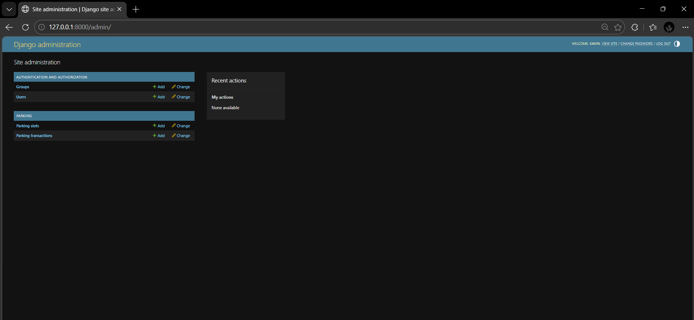

### Login Page

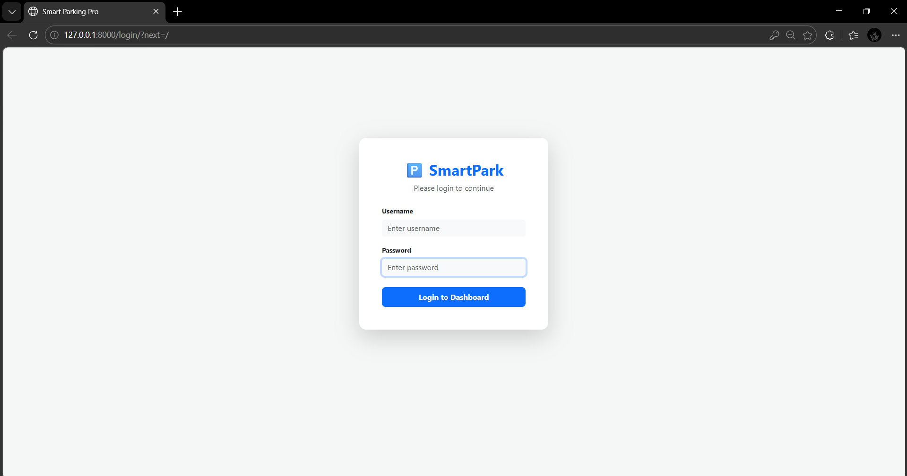

### Dashboard Page

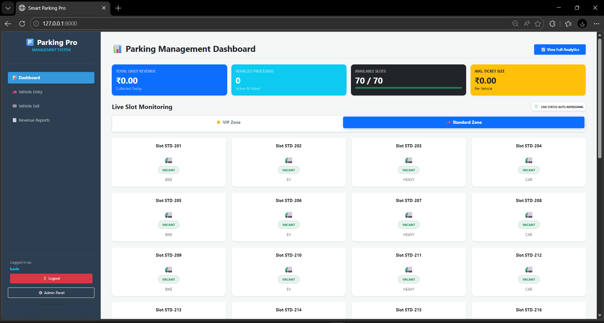

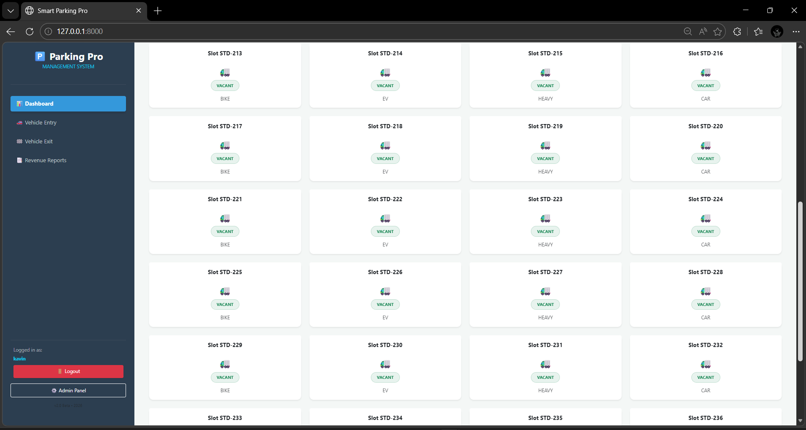

### Vehicle Entry Registration Page

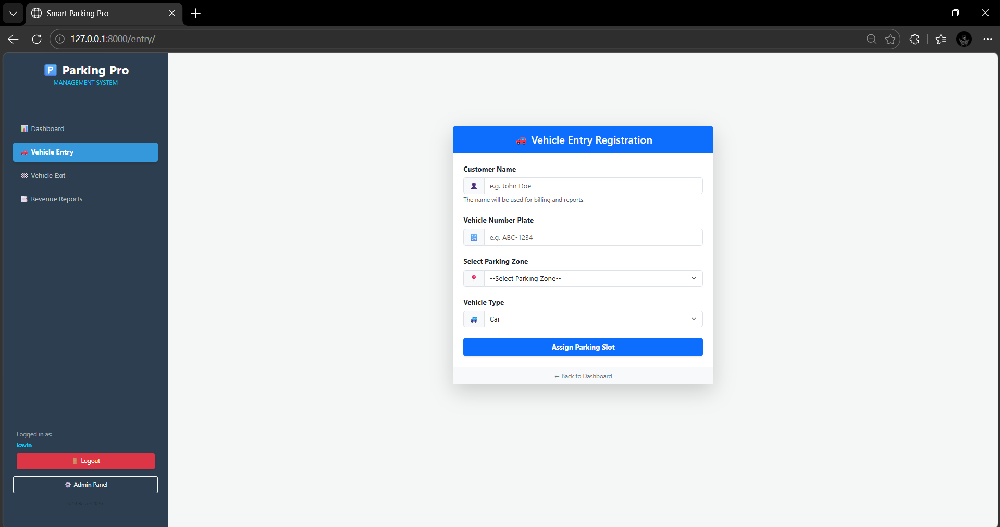

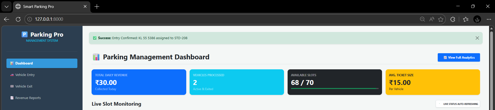

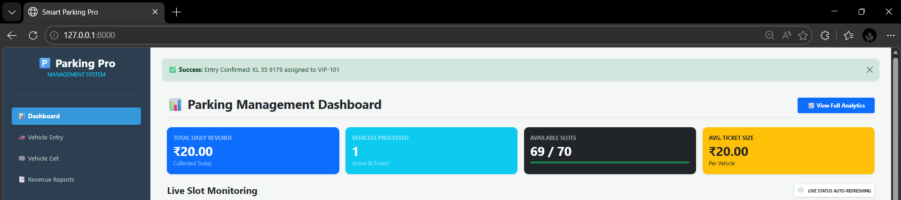

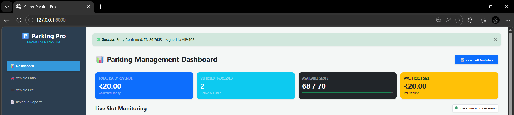

### Vehicle Exit from Parking 

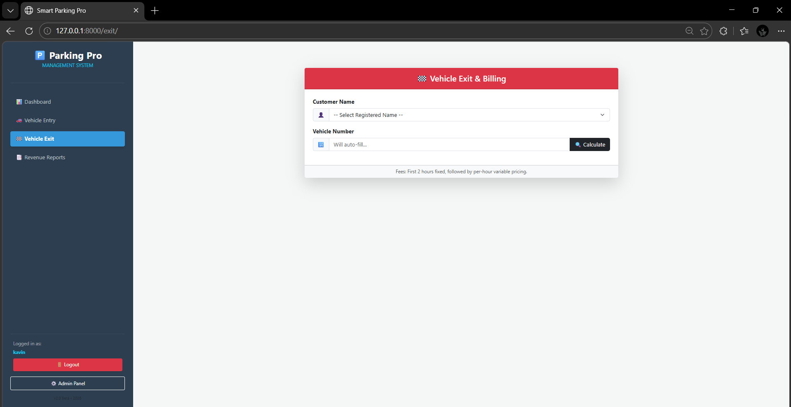

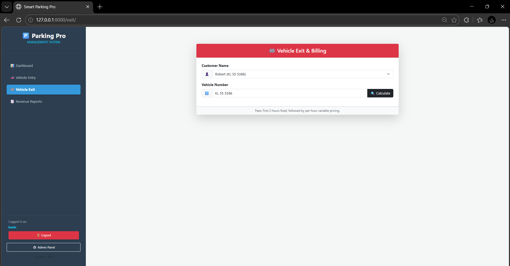

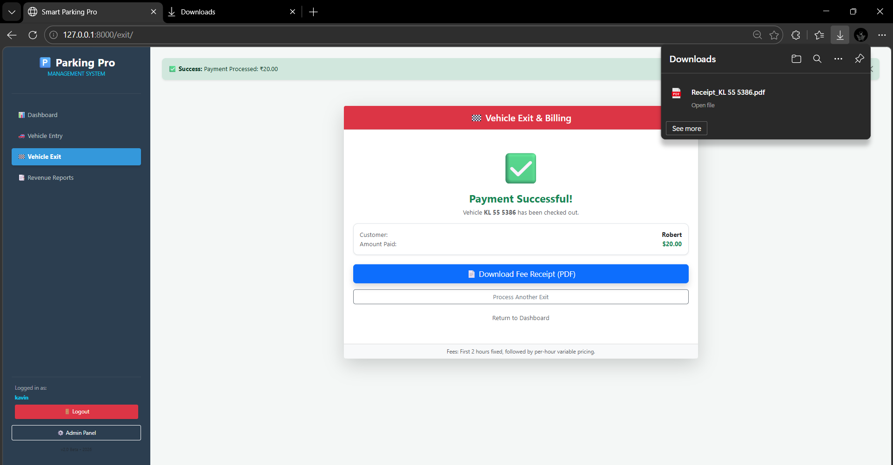

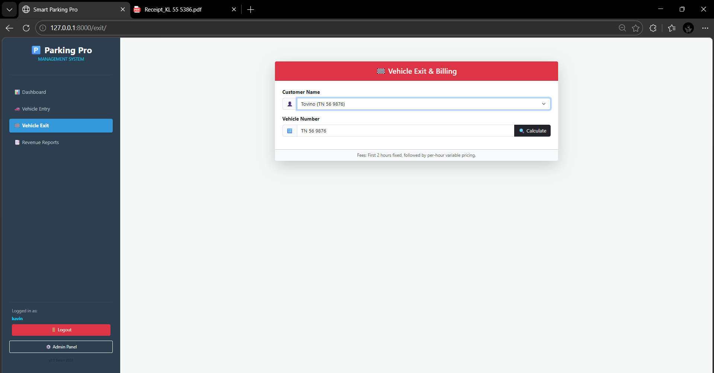

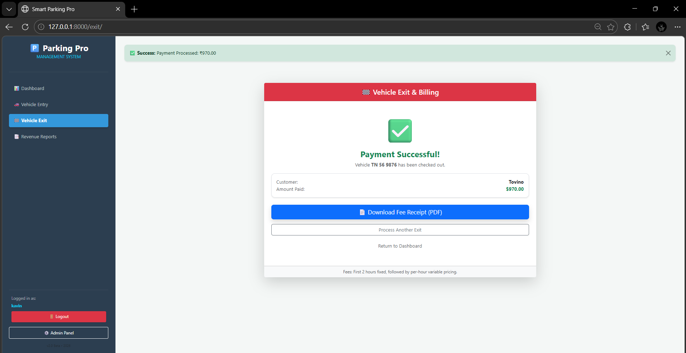

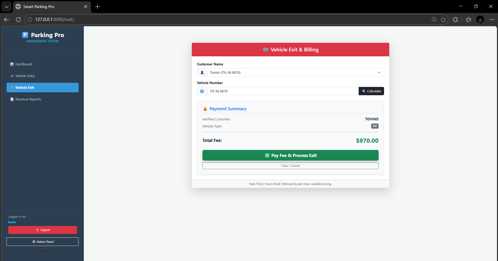

### Parking Bill

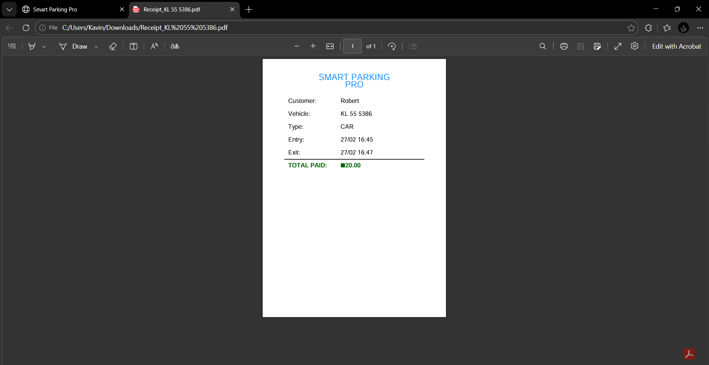

### Revenue Reports

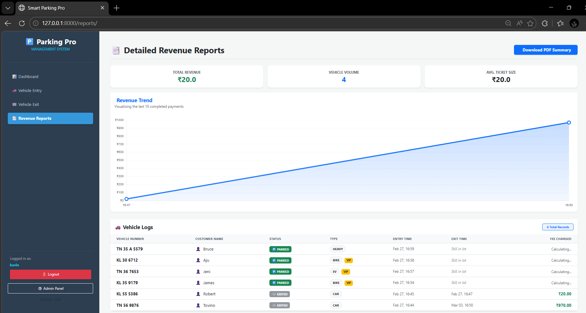

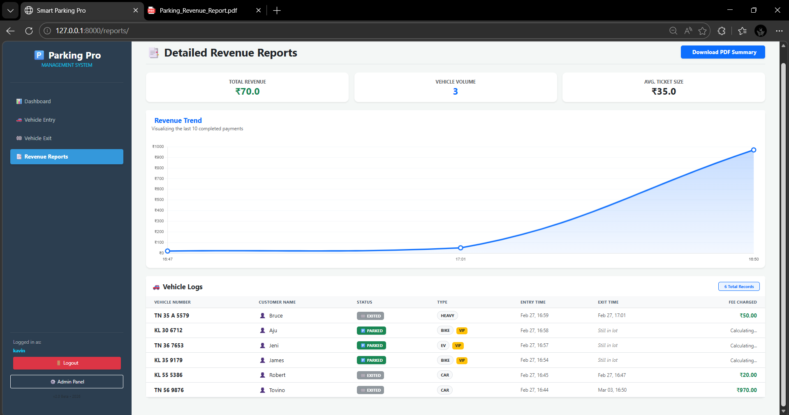

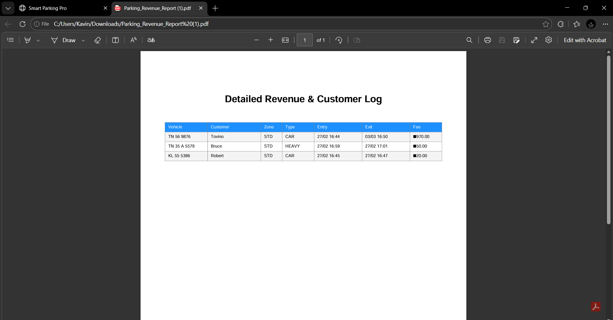

